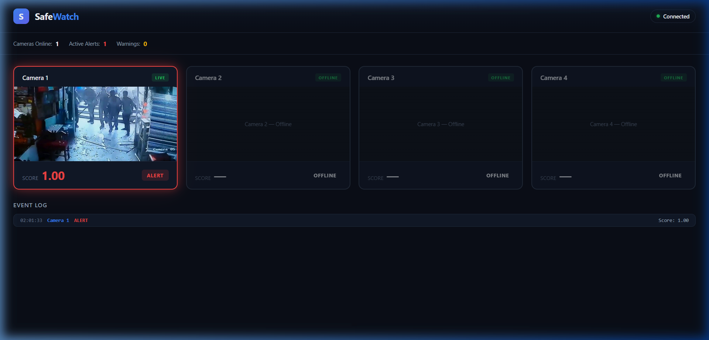

<p align="center">
  
</p>

<h1 align="center">SafeWatch</h1>
<p align="center">
  <strong>AI-Powered CCTV Anomaly Detection System</strong><br>
  Real-time fight detection using RAFT optical flow and LSTM neural networks, streamed live to a monitoring dashboard.
</p>

<p align="center">
  
  
  
  
  
</p>

---

## What Is SafeWatch?

SafeWatch is an end-to-end video surveillance system that **detects violent behavior in real-time** from CCTV footage. It processes live video feeds, extracts motion patterns using deep optical flow, and classifies them using a trained LSTM neural network — all streamed to a web dashboard with color-coded alerts.

**One command. Full system.**

```bash
python safewatch.py
```

The browser opens automatically. Camera tiles show live video. When a fight is detected, the tile glows red.

---

## How It Works

```
┌─────────────────────────────────────────────────────────────┐
│                     Video Source                            │
│          (CCTV / RTSP / Local file / Webcam)                │
└──────────────────────┬──────────────────────────────────────┘
                       │
                       ▼
┌──────────────────────────────────────────────────────────────┐
│  stream.py — Per-Camera Pipeline Thread                      │
│                                                              │
│  1. Frame Reader ──► FrameBuffer (for MJPEG display)         │
│  2. Motion Gate — skip static frames (saves ~85% compute)    │
│  3. RAFT Optical Flow — dense motion field between frames    │
│  4. 3×3 Spatial Grid — 9 cells × 2 stats = 18 features      │
│  5. Sliding Window — 30 frames (6 seconds of context)        │
└──────────────────────┬──────────────────────────────────────┘
                       │
                       ▼
┌──────────────────────────────────────────────────────────────┐
│  inference.py — LSTM Fight Detector                          │
│                                                              │
│  StandardScaler normalization → 2-layer LSTM → sigmoid       │
│  Output: fight probability score [0.0 – 1.0]                │
└──────────────────────┬──────────────────────────────────────┘
                       │
          ┌────────────┼────────────┐
          ▼                         ▼
┌──────────────────┐   ┌───────────────────────────────────────┐
│   alert.py       │   │   dashboard/index.html                │
│   WebSocket      │──►│                                       │
│   Broadcast      │   │   ● Live MJPEG video in tiles         │
│   Server         │   │   ● Red/Yellow/Green status glow      │
│   (ws://8765)    │   │   ● Real-time event log               │
└──────────────────┘   └───────────────────────────────────────┘
```

---

## Features

| Feature | Description |
|---|---|
| **One-Click Launch** | `python safewatch.py` starts everything — HTTP server, WebSocket alerts, AI pipelines, and opens the browser |
| **Live Video Feeds** | MJPEG streaming embedded in dashboard tiles — no external player needed |
| **Motion Gating** | Skips static frames before any AI runs, saving ~85% compute on typical surveillance footage |
| **RAFT Optical Flow** | State-of-the-art dense optical flow (TorchVision `raft_small`) captures precise motion patterns |
| **Spatial Features** | 3×3 grid divides the frame into 9 regions — captures *where* motion happens, not just *that* it happens |
| **LSTM Classifier** | 2-layer LSTM with 30-frame sliding window detects temporal fight patterns over 6 seconds |
| **Real-Time Alerts** | Score → status mapping: 🔴 ALERT (≥0.7), 🟡 WARNING (≥0.5), 🟢 NORMAL (<0.5) |
| **Multi-Camera** | Each camera runs in its own thread with an independent AI pipeline |
| **Thread-Safe Display** | `FrameBuffer` decouples video display from AI — dashboard stays smooth during inference |
| **Auto-Reconnect** | Dashboard WebSocket reconnects automatically if connection drops |

---

## Project Structure

```
SafeWatch/
├── safewatch.py          # Unified launcher — starts everything
├── config.py             # All tunable parameters in one place
├── stream.py             # FrameBuffer + CameraPipeline (per-camera thread)
├── inference.py          # LSTM model wrapper with scaler normalization
├── alert.py              # WebSocket server for real-time alert broadcast
├── dashboard/
│   └── index.html        # Self-contained monitoring dashboard (HTML/CSS/JS)
├── models/
│   ├── safewatch_lstm.pt        # Trained LSTM weights
│   └── safewatch_scaler.pkl     # Feature normalizer from training
├── autoencoder/          # Placeholder for secondary anomaly model
└── docs/
    └── dashboard_alert.png      # Screenshot for README
```

---

## Quick Start

### Prerequisites

```bash
pip install torch torchvision opencv-python scikit-learn websockets joblib
```

### Run

```bash
cd SafeWatch
python safewatch.py
```

The system will:
1. Start the dashboard server on `http://127.0.0.1:8080`
2. Start the WebSocket alert server on `ws://127.0.0.1:8765`
3. Launch camera pipelines for all configured sources
4. Open your browser automatically

### Configure Cameras

Edit `config.py` to define your video sources:

```python
CAMERAS = [
    {"id": "Camera 1", "source": "fight_clip.avi"},           # Local file
    {"id": "Camera 2", "source": "rtsp://192.168.1.10/live"},  # RTSP stream
    {"id": "Camera 3", "source": 0},                           # Webcam
    {"id": "Camera 4", "source": None},                        # Offline
]
```

---

## Model Architecture

### Feature Extraction

Each frame pair produces a **RAFT optical flow field**, which is divided into a **3×3 spatial grid** (9 cells). For each cell, two statistics are computed:

| Feature | What It Captures |
|---|---|
| `mean_mag` | Average motion intensity in the cell |
| `std_mag` | Motion chaos/variance in the cell (fight signature) |

This produces **18 features per frame** (9 cells × 2 stats).

### LSTM Classifier

```
Input:  (batch, 30, 18)  — 30 timesteps × 18 features
           │
    ┌──────▼──────┐
    │  LSTM Layer  │  hidden_size=64, num_layers=2, dropout=0.3
    └──────┬──────┘
           │ (last timestep)
    ┌──────▼──────┐
    │   Linear    │  64 → 1
    └──────┬──────┘
           │
    ┌──────▼──────┐
    │   Sigmoid   │  → fight probability [0, 1]
    └─────────────┘
```

**Training dataset:** [RWF-2000](https://github.com/mchengny/RWF-2000) — 2,000 surveillance clips (1,000 fights, 1,000 normal).

---

## Configuration Reference

All parameters live in `config.py`:

| Parameter | Default | Description |
|---|---|---|
| `INPUT_SIZE` | 18 | Features per frame (9 cells × 2 stats) |
| `HIDDEN_SIZE` | 64 | LSTM hidden state dimensions |
| `NUM_LAYERS` | 2 | Stacked LSTM layers |
| `WINDOW_SIZE` | 30 | Frames per sequence (6s at 5 FPS) |
| `STRIDE` | 5 | Frames between predictions (1s) |
| `FPS` | 5 | Target processing frame rate |
| `MOTION_THRESHOLD` | 2 | Pixel difference to trigger AI processing |
| `ALERT_THRESHOLD` | 0.7 | Score threshold for red alert |
| `WARNING_THRESHOLD` | 0.5 | Score threshold for yellow warning |
| `HTTP_PORT` | 8080 | Dashboard + MJPEG server port |
| `WS_PORT` | 8765 | WebSocket alert server port |

---

## Tech Stack

- **Deep Learning:** PyTorch (LSTM classifier)
- **Optical Flow:** TorchVision RAFT (`raft_small`)
- **Video Processing:** OpenCV
- **Feature Scaling:** scikit-learn `StandardScaler`
- **Real-Time Communication:** WebSockets (Python `websockets` library)
- **Dashboard:** Vanilla HTML/CSS/JS (zero dependencies, self-contained)
- **Streaming:** MJPEG over HTTP (native `` tag, no plugins)

---

## License

MIT
